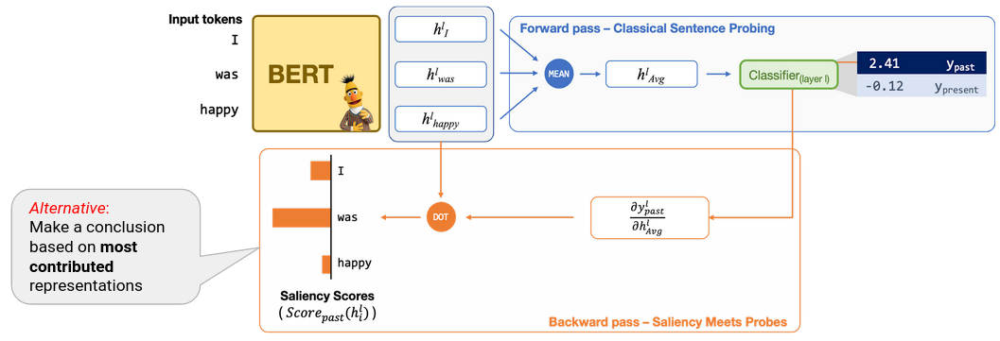

# Saliency Meets Probe

This is the official repo for the EMNLP 2021 paper [Saliency Meets Probes: Exploring the Role of BERT Token Representations to Explain Sentence Probing Results](https://arxiv.org/pdf/2104.01477.pdf).

See the [blog post](https://hmohebbi.github.io/blog/explain-probing-results) for the details!

